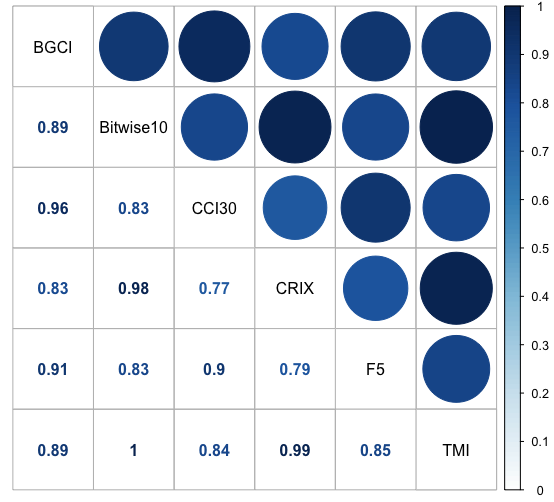

[](http://quantlet.de/)

## [](http://quantlet.de/) **SVCJrw_Indices_SharpeR** [](http://quantlet.de/)

```yaml

Name of QuantLet : 'SVCJrw_Indices_SharpeR'


Published in : 'SVCJrw' 


Description : 'This Quantlet computes the moments and the Sharpe Ratio for several cryptocurrency indices. Additionally the Probabilistic Sharpe Ratio (Bailey and Lopez de Prado 2012) are computed.'


Keywords : 'CC Indices, CRIX, Moments, Sharpe Ratio, Probabilistic Sharpe Ratio'


Author : 'Konstantin Häusler'
```




### R Code
```r

##############################################
# R_Script for evaluation of CC Indices#######
##############################################
library(quantmod)
library(moments)
library(corrplot)
library(xtable)
library(RColorBrewer)
display.brewer.all()
colors <- brewer.pal(11, "Paired")

###############################
# Set directory and load data #
###############################
load(file = "all_indices.rda")
load(file = "/Users/konstantin/Desktop/dateien/IRTG 1792/econCRIX/svcj/svcj/1st_paper_KH_Quantlets/KH_Indices_SharpeR/daily_sums_n.rda")

#merge
data <- merge(test5, daily.sums.n[, c("date", "total_mc")], by.x = "Date", by.y = "date", all.x = T)
data$TMI <- NULL
names(data)[names(data) =="total_mc"] <- "TMI"
data <- data[-1,]

##########################
#Statistics of Indices####
##########################

#norm indices
index.names <- names(data)[-1]
for (i in index.names) {
  data[, paste(i, "_normed", sep = "")] <-data[, i] / data[1,i] *1000
}

#compute returns
for (i in index.names) {
  data[, paste(i, "_return", sep ="")] <- Delt(data[,i])
}

#moments
avg_returns <- apply(data[,paste(index.names, "_return", sep = "")], 2, FUN = function(x){mean(x, na.rm = T)})
standarddeviation_returns <- apply(data[,paste(index.names, "_return", sep = "")], 2, FUN = function(x){sd(x, na.rm = T)})
skewness <- apply(data[,paste(index.names, "_return", sep = "")], 2, FUN = function(x){skewness(x, na.rm = T)})
kurtosis <- apply(data[,paste(index.names, "_return", sep = "")], 2, FUN = function(x){kurtosis(x, na.rm = T)})
sharpe_ratios <- avg_returns / standarddeviation_returns

#PSR
psr <- NULL
for (i in c(1:6)) {
  input <- (sharpe_ratios[[i]] * sqrt(len -1)) / sqrt(1-skewness[[i]] * sharpe_ratios[[i]] + ((kurtosis[[i]] -1)/4)*sharpe_ratios[[i]]^2)
  tmp <- pnorm(input)
  print(tmp)
  psr <- rbind(psr, tmp)
}

output <- data.frame(sharpe_ratio = sharpe_ratios, 
                     returns = avg_returns, 
                     vola = standarddeviation_returns,
                     skewness = skewness,
                     kurtosis = kurtosis,
                     PSR = psr,
                     row.names = index.names)
xtable(output, digits = 3)

##########################
#Visualization of Indices#
##########################

par(xpd = T, mar = par()$mar + c(0,0,0,7),bg=NA)

plot(data$TMI_normed ~data$Date,  type ="l", ylim = c(0, 2000), xlab="", 
     ylab="Index Values", lwd = 2, lty = 1)
lines(data[,"CRIX_normed"] ~ data$Date, type = "l", lty=3, lwd=2.2)
lines(data[,"Bitwise10_normed"] ~ data$Date, type="l", col= colors[3], lwd=1.5, lty=3) #15
lines(data[,"CCI30_normed"] ~ data$Date, type="l", col= colors[2], lwd=1.5, lty=3)                 #19
lines(data[,"F5_normed"] ~ data$Date, type="l", col= colors[6], lwd=1.5, lty=3)                 #23
lines(data[,"BGCI_normed"] ~ data$Date, type="l", col= colors[8], lwd=1.5, lty=3)    #25

legend("right",
       inset=c(-0.3,0), xpd = T, #cancel out when not outside
       legend=index.names, 
       col=c("black",colors[c(3,2,6,8)], "black"),
       #pch=c(19), pt.cex=1, 
       #bg='lightgrey',
       cex = 0.8,
       lwd = 3,
       lty = c(rep(3.5,5),1.5)
       #text.col = c("black", colors)
)

############################
#Corrletation Indices & TMI#
############################

ind.cor <- cor(data[, index.names], use="complete.obs")
corrplot(ind.cor,method = "color", order = "AOE")

corrplot.mixed(ind.cor, 
               order = "alphabet", 
               lower = "number", 
               upper = "circle",
               tl.col = "black",
               cl.lim = c(0,1)
              )
corrplot.mixed(ind.cor, 
               #method = "color", 
               order = "alphabet", 
               lower = "number", 
               upper = "circle",
               upper.col= colorRampPalette(c("white","lightpink","pink"))(200),
               lower.col= colorRampPalette(c("blue","white","lightpink","pink","red"))(200),
               tl.col = "black",
               cl.lim = c(0,1)
)

#Bootstrap samples, compute correlation, average or boxplots


# Creating Function to obtain Correlations from the data
corr_tmi_index <- function(sel.index, indices) {
  dt <- data[indices,c(sel.index,"TMI" )] 
  fit.cor <- cor(dt[,sel.index], dt[,"TMI"], use="complete.obs")
  return(fit.cor)
} 
corr_tmi_index(sel.index = "CRIX", indices= c(1:100))

cor.vec <- NA
for (i in c(2:506)) {
  tmp <- i+ 100
  ind <- c(1:tmp)
  tmp.cor <- corr_tmi_index(sel.index = "CRIX", indices=ind)
  cor.vec[i] <- tmp.cor
}

boxplot(cor.vec)

library("vioplot")
vioplot(cor.vec.ma, col = 1:5, border = 1:5)

#now with random draws
cor.vec.ma <- data.frame()
for (j in index.names) {
  for (i in c(1:1000)) {
    ind <- sample(c(1:606), 100)
    tmp.cor <- corr_tmi_index(sel.index = j, indices=ind)
    cor.vec.ma[i,j] <- tmp.cor
  }
}
vioplot(cor.vec.ma, col = 1:5, border = 1:5)


```

automatically created on 2021-02-21