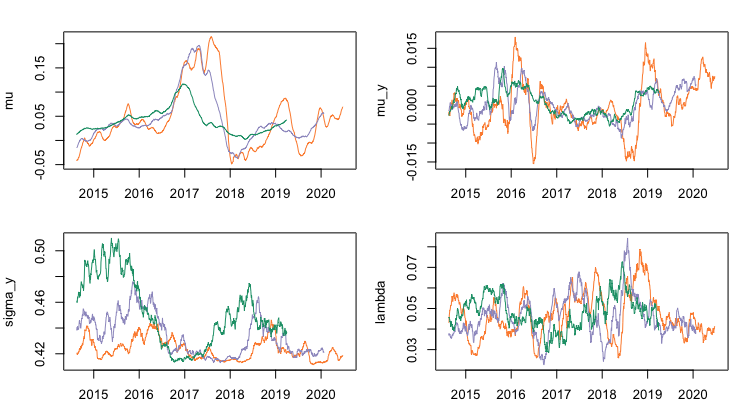
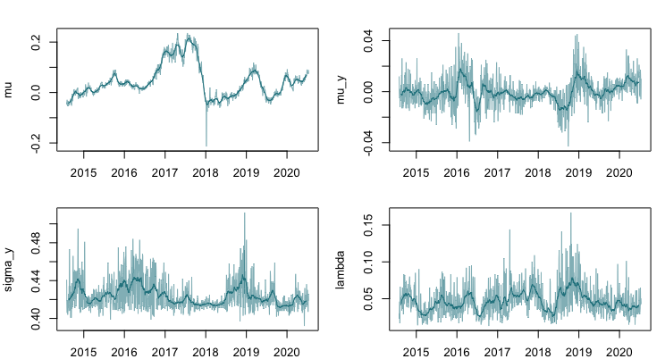
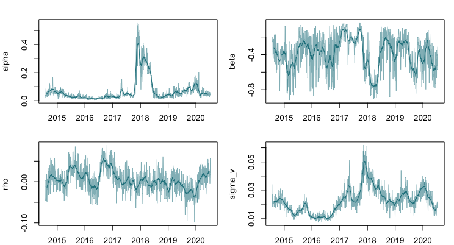
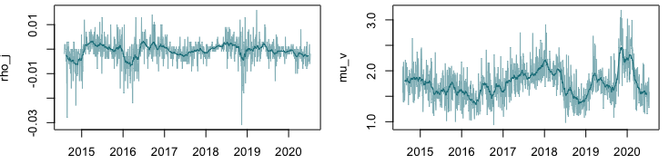
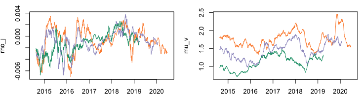

[](http://quantlet.de/)

## [](http://quantlet.de/) **SVCJrw_graph_parameters** [](http://quantlet.de/)

```yaml

Name of QuantLet : 'SVCJrw_graph_parameters'


Published in : 'SVCJrw'


Description : 'This Quantlet takes SVCJ estimates of different rolling window sizes and visualizes them. Each line refers to time-series estimates of the respective parameter'


Keywords : 'Cryptocurrencies, CRIX, SVCJ, rolling window'


Author : 'Konstantin Häusler'

```












### R Code
```r

load("param_t_all.rda")

#weights for moving average
f20 <- rep(1/20, 20) #MA of 20 days

#visualization of estimates
var.list <- c("mu", "mu_y", "sigma_y", "lambda", "alpha", "beta", "rho","sigma_v", "rho_j", "mu_v")
for (i in var.list) {
  plot(param.t.all[,paste(i, ".150", sep = "")] ~param.t.all$date, 
       data=param.t.all, 
       type="l", ylab=i, xlab="date", col="#26828E90")
  #add moving average 
  ma.tmp1 <-  stats::filter(param.t.all[,paste(i, ".150", sep = "")],filter = f20, method = "convolution", sides = 2)
  lines(ma.tmp1 ~param.t.all$date,  type="l", col= "#26828E")
}

#the three time series of moving averages (ma) for 150 300 600

for (i in var.list) {
  #calculate moving averages (ma) for each window size
  ma.tmp1 <-  stats::filter(param.t.all[,paste(i, ".150", sep = "")],filter = f20, method = "convolution", sides = 2)
  ma.tmp2 <-  stats::filter(param.t.all[,paste(i, ".300", sep = "")],filter = f20, method = "convolution", sides = 2)
  ma.tmp3 <-  stats::filter(param.t.all[,paste(i, ".600", sep = "")],filter = f20, method = "convolution", sides = 2)
  #plot ma's
  plot(ma.tmp1 ~param.t.all$date,  xaxt='n',
       type="l", ylab=i, xlab="", col= "#FD8D3C",
       ylim=c(min(c(ma.tmp1, ma.tmp2, ma.tmp3), na.rm = T), max(c(ma.tmp1, ma.tmp2, ma.tmp3), na.rm = T)))
  axis.Date(1, param.t.all$date)
  lines(ma.tmp2 ~param.t.all$date,  type="l", col= "#9E9AC8")
  lines(ma.tmp3 ~param.t.all$date,  type="l", col= "#1B9E77", pch=18)
}
```

automatically created on 2021-02-21